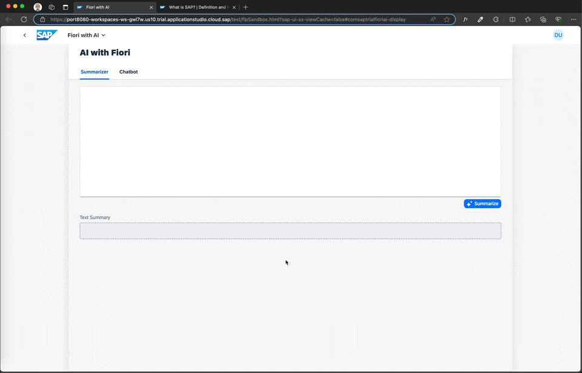
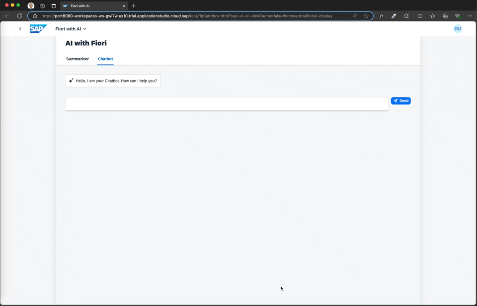
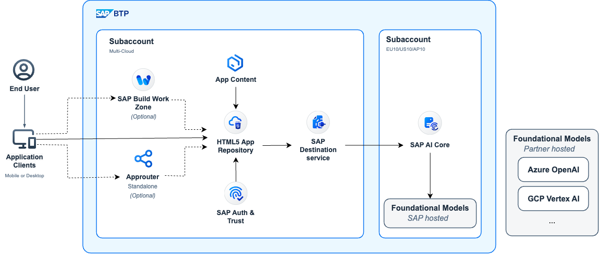
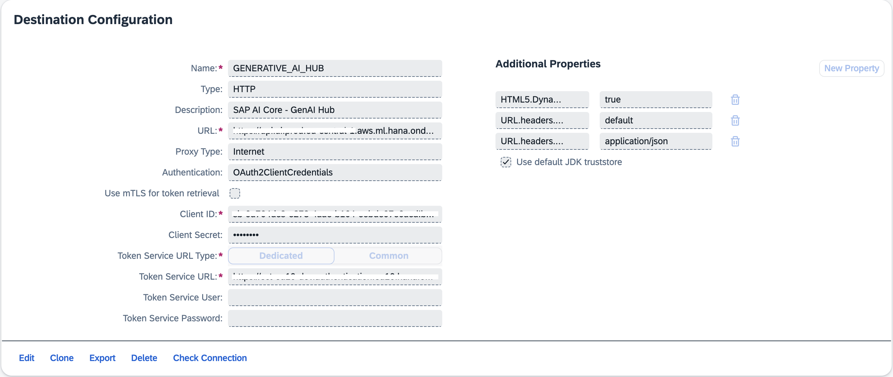

# Integrate Fiori UIs with SAP GenAI Hub - LLMs

This repository demonstrates how to **integrate** Fiori UIs (Freestyle, Fiori Elements, Flexible Programming Model) with LLMs in SAP GenAI Hub in a **Secured way** using **BTP Destination Service**.

## Blog

1. [Integrating AI with SAPUI5 Fiori Apps: Part 1 - Concept](https://community.sap.com/t5/technology-blogs-by-sap/integrating-ai-with-sapui5-fiori-apps-part-1-concept/ba-p/13734579)
2. [Integrating AI with SAPUI5 Fiori Apps: Part 2 - Building a Text Summarizer](https://community.sap.com/t5/technology-blogs-by-sap/integrating-ai-with-sapui5-fiori-apps-part-2-building-a-text-summarizer/ba-p/13736465)
3. [Integrating AI with SAPUI5 Fiori Apps: Part 3 - Building an AI Chatbot Assistant](https://community.sap.com/t5/technology-blogs-by-sap/integrating-ai-with-sapui5-fiori-apps-part-3-building-an-ai-chatbot/ba-p/13736501)

## Demos



*AI Text Summariser*



*AI Assistant Chatbot*

## BTP Solution



*BTP Solution - SAPUI5 Fiori integration with LLM via SAP AI Core*

## Prerequisites

1. Install [NodeJS](https://nodejs.org/)
2. Create an SAP AI Core instance - see [AI Core - initial-setup](https://help.sap.com/docs/sap-ai-core/sap-ai-core-service-guide/initial-setup)
3. Create a GenAI LLM deployment - see [documentation](https://help.sap.com/docs/sap-ai-core/sap-ai-core-service-guide/create-deployment-for-generative-ai-model-in-sap-ai-core)

## Getting Started

1. Clone this repository
   1. For **SAP Build Code**, click 'Clone' from the Lobby and provide the Git URL and a project name.
   2. For local development, clone the repository and navigate to the folder where the repository is cloned.
2. Run `npm install` to install the dependencies.
3. Create a new Destination pointing to the SAP AI Core LLM deployment URL

   ```yaml
   Name: GENERATIVE_AI_HUB
   URL: <AI_API_URL>/v2 # Eg. https://api.ai....ml.hana.ondemand.com/v2 <- Note the suffix /v2
   Authentication: OAuth2ClientCredentials
   Client ID: <CLIENT_ID>
   Client Secret: <CLIENT_SECRET>
   Token Service Url: <TOKEN_URL>/oauth/token

   ## Additional Properties
   HTML5.DynamicDestination: true
   URL.headers.AI-Resource-Group: default
   URL.headers.Content-Type: application/json
   ```

   

### a. Deployment

1. Build an MTAR for deployment
   ```bash
   npx mbt build
   ```
2. Deploy the MTAR archive
   ```
   cf deploy mta_archives/comsaptrialfioriai_0.0.1.mtar
   ```

### b. Local Development

**Note**: The UI resources should be deployed at least once to create necessary BTP services needed for local deployment.

1. Duplicate the `default-env.example.json` file and rename it to `default-env.json`
2. Fill in the credentials for Destination & XSUAA service in `default-env.json`
3. Start the local server
   ```bash
   npm start
   ```

## License

This project is licensed under the [Apache License, Version 2.0](./LICENSE).